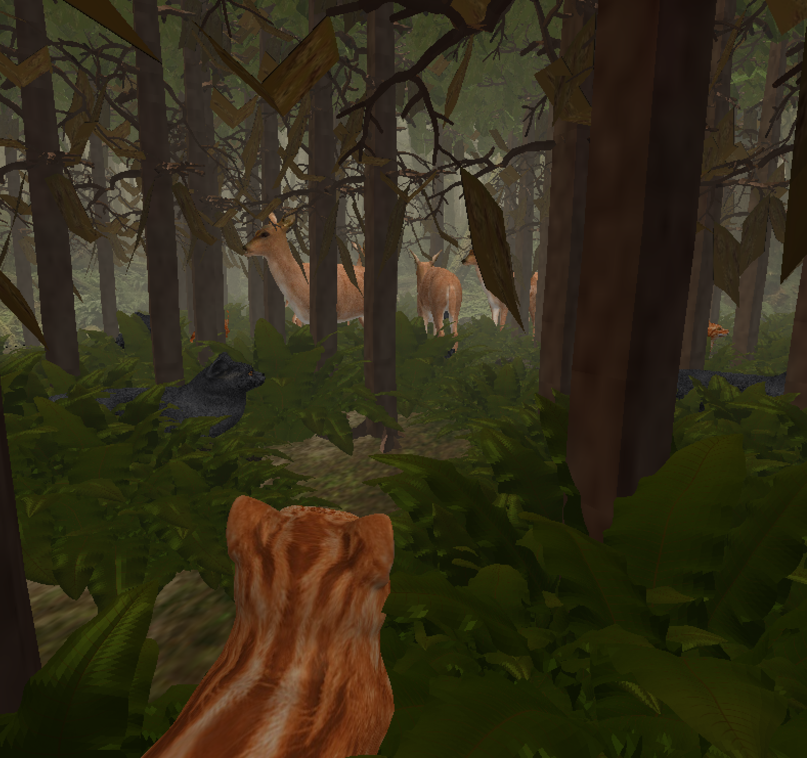

# Forest Scene OpenGL Graphics Project

## Overview
This project is a forest scene animation created using OpenGL. It features a dynamic, animated forest environment with trees, bushes, rocks, and animals, including deer, cats, and a bear. The scene includes custom shaders for animations, multitextured objects, and vertex buffer objects for optimized rendering.

   

## Scene Description
The scene simulates a forest environment with dynamic interactions between animals. As the animation progresses, the following happens:

1. **Animals appear in the forest:** The deer and cats peacefully run around and graze in the forest.
2. **The bear appears:** The bear scales into the scene, startling the other animals.
3. **Animals scatter:** The deer, cats, and other animals scale down and become invisible, leaving only the bear visible.
4. **The bear leaves:** After the bear disappears, the other animals scale back into the scene and resume their activities.

## Features

### Custom <code>.obj</code> File Loader

This project uses two custom <code>.obj</code> file loaders developed specifically for its needs:

* <code>LoadTreeGeometry</code>: Designed to extract a specific object from a multi-object .obj file and generate vertex and index arrays for use with vertex buffers.
* <code>LoadGeometry</code>: General-purpose loader for handling entire .obj files, also generating vertex and index arrays for optimized rendering.
The original <code>.obj</code> file loader provided in the skeleton program served as a starting point for these functions.

### Shader Animations
Smooth, natural animal movements are achieved through parabolic and sinusoidal equations applied in vertex shaders. These include:

* Head-turning for the deer, bear, and cats.
* Grazing animation for the deer.
* Running motion for the cats.

These dynamic elements are then animated using keyframed animations to scale animals in and out of the scene, and control their movment across the scene.

### Multitexturing

The bushes are rendered with both diffuse and specular textures, enhancing their realism.

### Fog Effect

Depth cueing is used to create a semi-transparent fog, adding realistic foggy atmosphere to the forest scene.

### Vertex Buffer Objects (VBOs)

Static objects like trees, bushes, and rocks are rendered using vertex buffer objects, reducing lag and improving performance.

## Showcase  

Check out the project in action:  
 
<video width="600" controls>
  <source src="assets/Forest.mp4" type="video/mp4">
  Your browser does not support the video tag.
</video>

## Acknowledgments
This project was developed as part of the CS 450 Computer Graphics class at Oregon State University, using a skeleton program provided by Professor Mike Bailey.

The <code>.obj</code> files used in this project were downloaded from free online sources.
